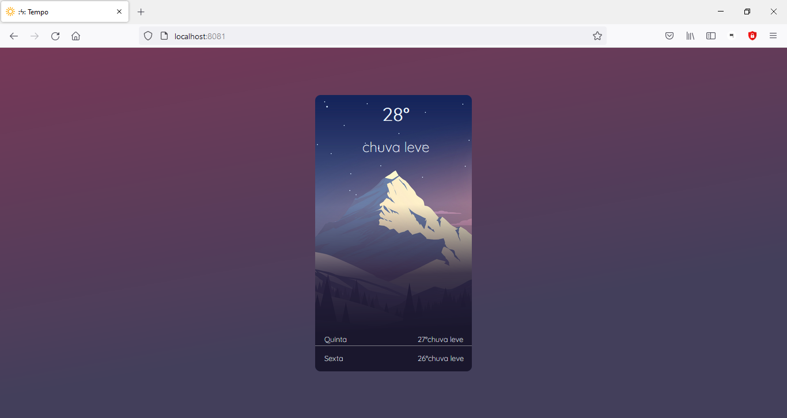

# DeployEstatico-SD

Atividade da cadeira de Sistemas Distribuídos do curso de Análise e Desenvolvimento de Sistemas.

>Objetivo: fazer deploy de uma página estática em ambiente containerizado

A aplicação é uma página com um card exibindo a previsão do tempo. O front-end é feito com ReactJS e consome a API do <https://openweathermap.org>. O ambiente de container está configurado no dockerfile, como base está definida a imagem do servidor Nginx, no dockerfile copio a pasta de build para dentro do container, sobreescrevo o arquivo de configuração do servidor com as minhas configurações, depois disso é só construir a imagem e rodar um container com a imagem gerada.

## Como executar

```bash
source RUN.sh
```
## Interface


[Voltar ao topo](#deployestatico-sd)